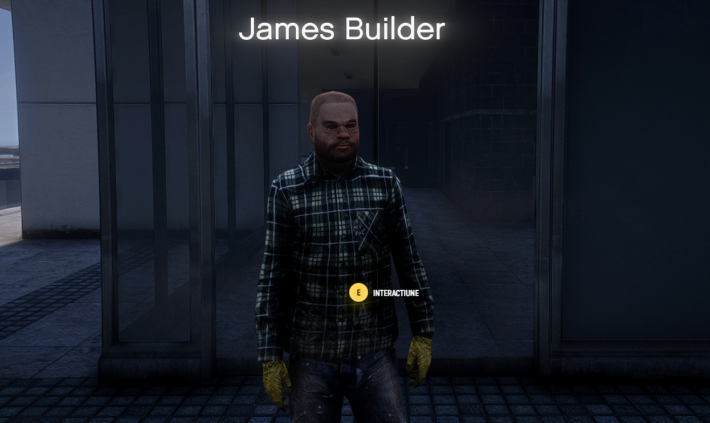
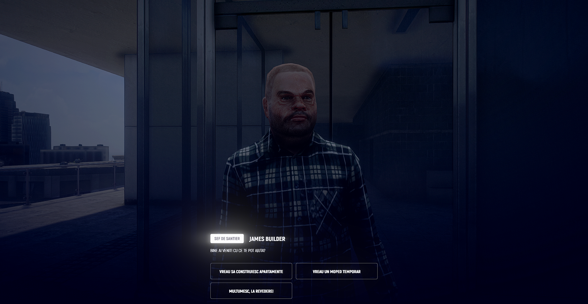
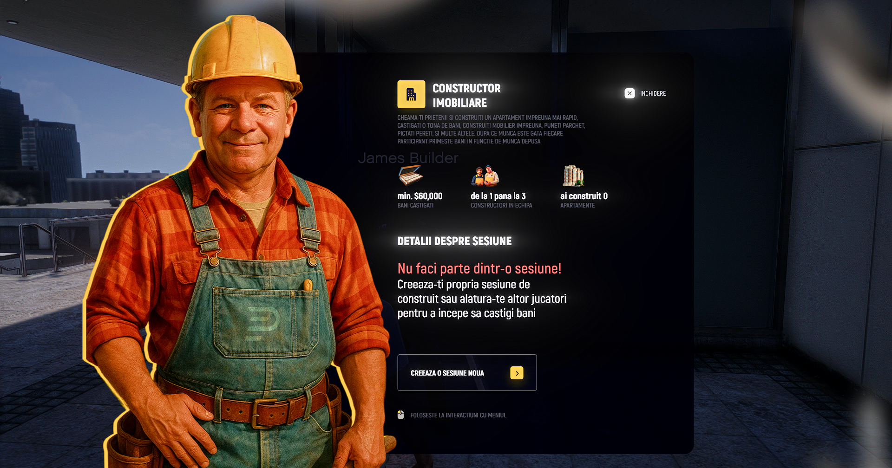
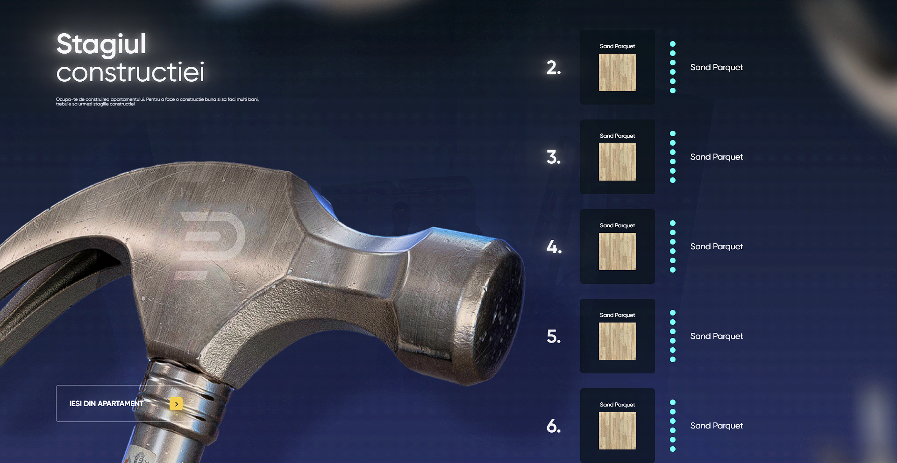
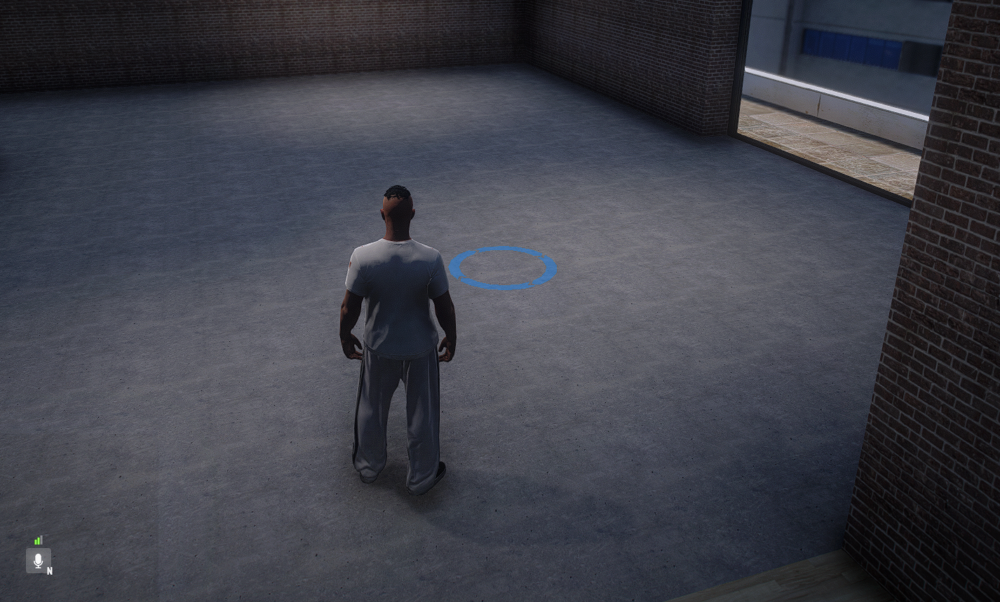

# 👷🏽‍♂️Constructor

Vrei un job stabil, serios și bine plătit? Jobul de Constructor pe Prime România îți oferă un mix perfect de muncă, RP și bani câștigați corect.

## 🛠️ 1. Cum te angajezi:

* Mergi la Agenția de Muncă (marcată cu iconița 🛠️ pe hartă).

* Apropie-te de punctul de interacțiune și apasă E.

* Selectează din listă **(Vreau sa construiesc apartamentul)**.

* Creeaza-ți o sesiune noua (singur sau cu un prieten).
* Puteți lucra de la 1 pana la 3 playeri de o data.

## 📍 2. Punctul de lucru:

* După angajare, te va trimite într-un apartament in lucru.
* Vei apasa tasta ,, E ,, si ti se va deschide un meniu:

* Vei selecta in ordine fiecare material care trebuie montat in apartament
* Vei vedea puncte de lucru (cercuri sau markere) unde poți începe efectiv activitatea.

## 👷 3. Cum lucrezi:

* Intra in punctul de muncă activ.
* Repetă procesul în mai multe puncte pentru a finaliza un "ciclu de muncă".

## 💼 4. Plata:

* Primești bani pentru fiecare apartament finalizat.**(min 60.000💵)**
* La finalul turei , te va scoate din apartament si iti vei lua banii
* Banii sunt oferiți cash sau direct în cont, în funcție de sistemul de plată activ.

## 📦 6. Avantaje:

✅ Nu ai nevoie de permis sau licențe speciale.

✅ Ideal pentru jucători noi care vor bani rapid și legal.

✅ Poți combina munca cu RP realist.
