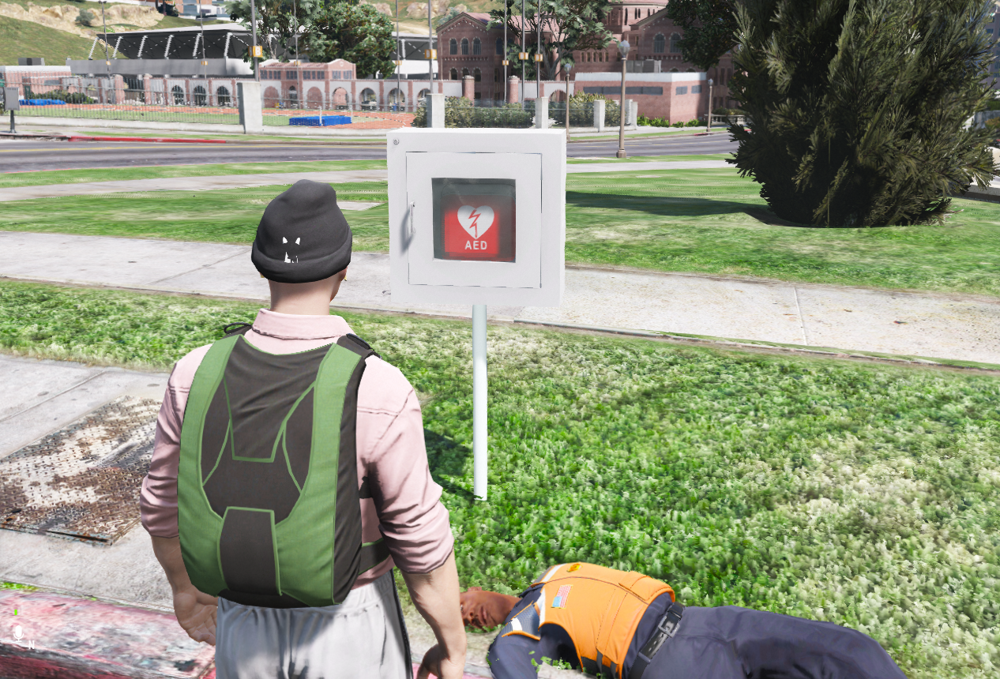

# 🏥Defibrilator

1. **Mergi la cutia cu defibrilator**
   * Localizează cutia unde este depozitat defibrilatorul.(de obicei se gasesc la marginea străzii)
   * Ia defibrilatorul din cutie.
2. **Apropie-te de jucătorul pe care vrei să-l resuscitezi**
   * Ține defibrilatorul în mână și poziționează-te lângă jucător.
   * Dispozitivul va analiza starea acestuia.
3. **Verifică mesajul afișat de defibrilator**
   * **Dacă se aude:** **"SHOCK NOT ADVISED"**
     * Jucătorul este declarat **decedat definitiv**.
     * Nu mai poate fi readus la viață – moarte permanentă.
   * **Dacă se aude:** **"SHOCK ADVISED"**
     * Așteaptă instrucțiunea vocală **"PUSH TO SHOCK"**.
     * Apasă **SPACE** pentru a administra șocul electric.
     * **Atenție:** dacă ești prea aproape de jucător în momentul șocului, vei fi electrocutat și tu.
     * După șoc, defibrilatorul va efectua **CPR** și jucătorul va fi **reînviat**.
4. **Returnează defibrilatorul**
   * După folosire, pune defibrilatorul înapoi în cutia de unde l-ai luat.

⚠️ **Sfaturi utile**

* Păstrează distanța când apeși **`SPACE`** pentru a evita șocul.
* Nu încerca să reînvii un jucător dacă dispozitivul spune **"SHOCK NOT ADVISED"** – este pierdere de timp.
* Întotdeauna returnează defibrilatorul, poate fi necesar și pentru altcineva.
