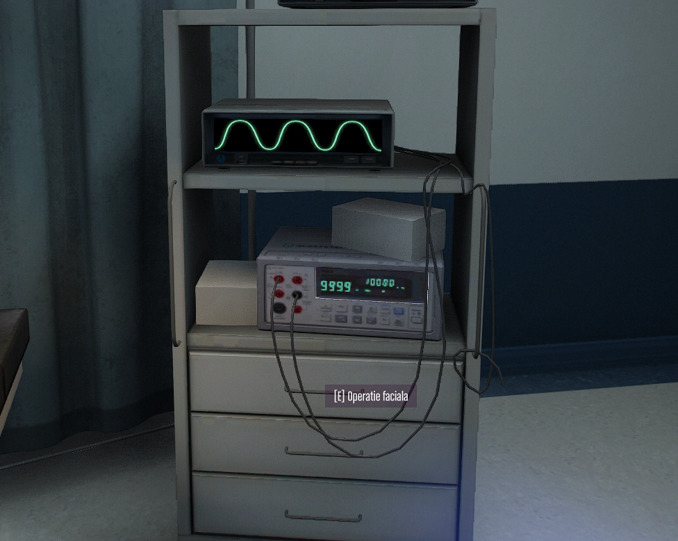
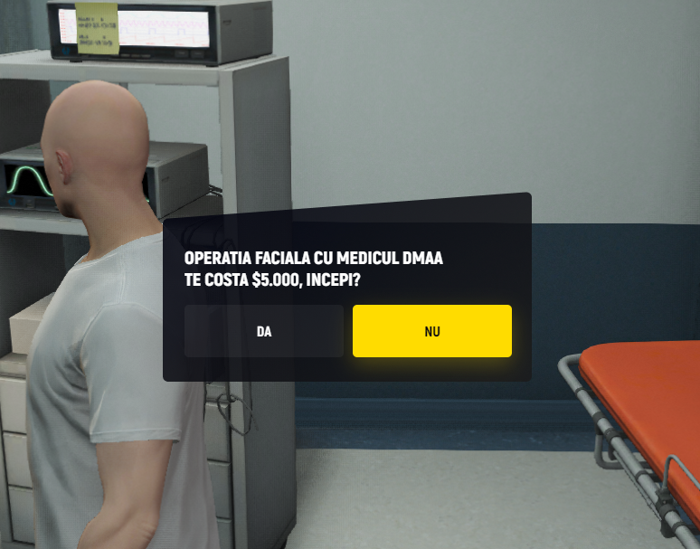
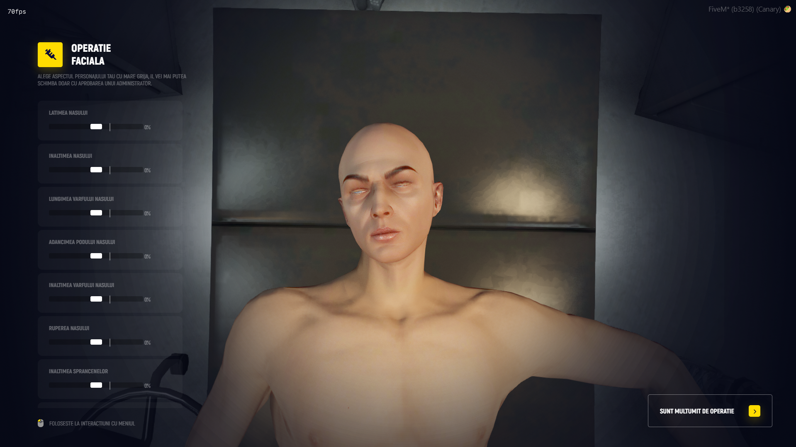
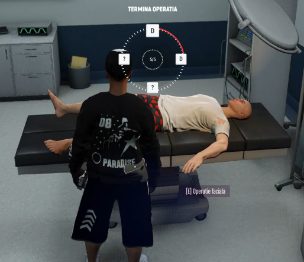

# 👧🏽Operatie Faciala

### 👄 Ce este operația facială?


!!! **Operația facială** îți permite să-ți modifici integral fața personajului, pentru a-i schimba complet aspectul.


### 👣 Pași pentru a face o operație facială:

#### 👟 Mergi la spital

* Pentru a începe, trebuie să mergi la spitalul din oraș.
* Acolo, caută un medic (player cu rol de medic).

#### 🗯️ Discuta cu medicul

* Medicul te va duce într-o cameră specială de operație.
* În această cameră, vei merge la aparatură si vei apăsa **`E`**

#### 💲 Costul operației

* Pe ecran îți va apărea prețul operației.

* Dacă ești de acord, poți accepta să plătești și să începi operația.

#### 🩺 Rolul medicului

* Medicul trebuie să rămână alături de tine și să te asiste pe toată durata operației.

#### 🕹️ Minigame-ul de aprobare

* În timpul operației, medicul trebuie să faca operația printr-un **minigame**.

* Doar după ce minigame-ul este completat cu succes, operația este finalizată și modificările sunt aplicate!!

#### 📢 Sfaturi utile:

* Asigură-te că ai bani suficienți înainte de a începe operația.
* Alege un medic de încredere pentru a te ajuta.
