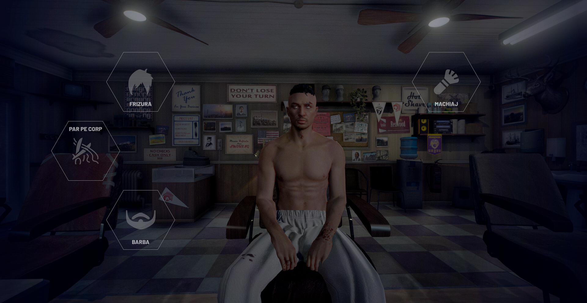

# ✂️Frizerie

Pe serverul Prime România, frizeria are un sistem complet nou, interactiv și realist. Iată cum îl folosești pas cu pas:

## 🗺️ 1. Cum ajungi la frizerie:

* Găsești frizeria marcată pe hartă cu iconița ✂️.
* Intră în clădire și apropie-te de scaunul principal pentru a începe interacțiunea.

## 🪑 2. Cum începi sistemul:

* Odată așezat pe scaun, se va deschide automat **meniul de personalizare**.
* Pe ecran vei vedea 5 opțiuni:

🔹 **Frizură** – schimbă stilul părului, lungimea, culoarea etc.

🔹 **Barbă** – alege modelul, desimea și culoarea bărbii.

🔹 **Machiaj** – opțiuni pentru detalii RP (vânătăi, tatuaje temporare, fard etc.).

🔹 **Păr pe corp** – adaugă sau elimină păr pe piept, brațe, etc.

## ✏️ 3. Cum folosești opțiunile:

* Navighezi prin meniuri cu **mouse-ul**.
* Dai click pe categoria dorită (ex: „Frizură”).
* Alege din listă stilul preferat.
* Poți **ajusta culorile** și intensitatea cu slider-e dedicate.
* Poți previzualiza în timp real toate schimbările.

## 💰 4. Confirmare & plată:

* După ce ai terminat personalizarea, confirmă alegerea ta.
* Vei plăti o sumă din banii tăi in-game (cash sau card).
